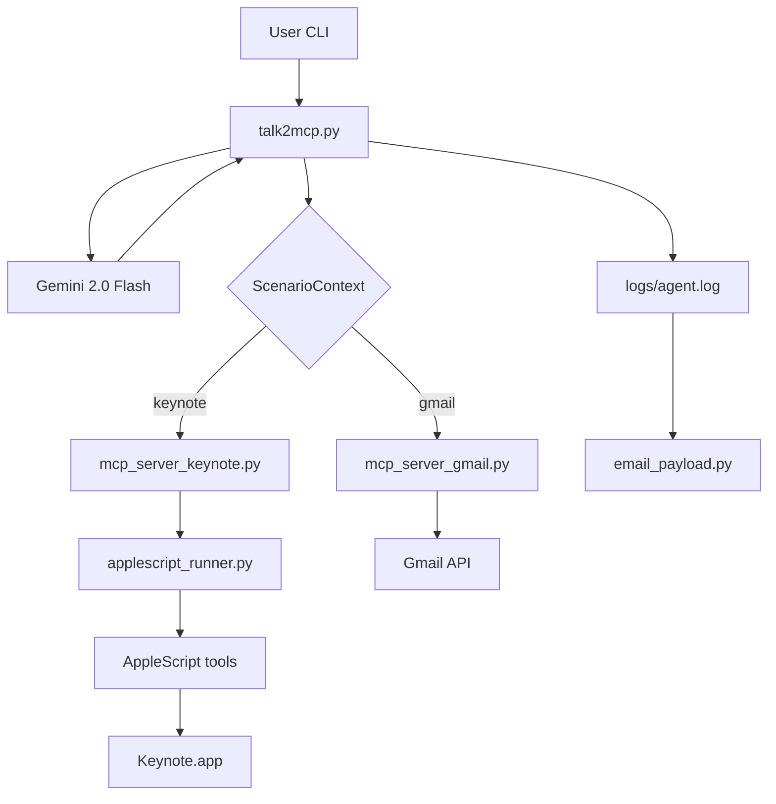
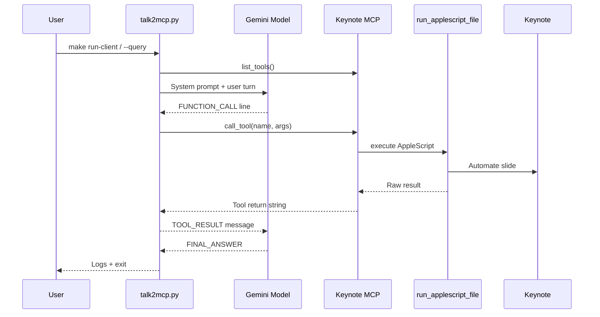
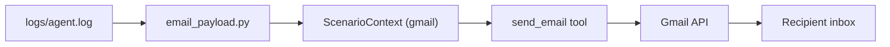

# MCP Keynote Drawing Agent (macOS)

This repository hosts a complete Model Context Protocol (MCP) workflow for automating Apple Keynote from an LLM agent on macOS. A Gemini 2.0 Flash client in `src/client` drives FastMCP servers that expose AppleScript tools for drawing on slides, plus an optional Gmail server for sending run summaries via email.

- Keynote scenario: open Keynote, capture slide geometry, draw a centered rectangle, and drop user-provided text inside it.
- Gmail scenario: reuse the client orchestrator to call a `send_email` tool backed by the Gmail API, hydrating the payload from the latest agent log.

## Table of Contents
- [Architecture Overview](#architecture-overview)
- [Repository Layout](#repository-layout)
- [Setup](#setup)
- [macOS Permissions](#macos-permissions)
- [Running the Workflows](#running-the-workflows)
- [Logging and Artifacts](#logging-and-artifacts)
- [Linting and Tests](#linting-and-tests)
- [Configuration Reference](#configuration-reference)
- [Troubleshooting](#troubleshooting)
- [Demo Checklist](#demo-checklist)

## Architecture Overview





## Repository Layout

```
eag2-mcp-mac/
├── AGENTS.md
├── Makefile
├── README.md
├── requirements.txt
├── .env.example
├── docs/
│   └── SPEC.md
├── logs/
├── scripts/
│   ├── dev_run_client.sh
│   ├── record_demo_checklist.md
│   └── send_email_via_mcp.py
├── src/
│   ├── __init__.py
│   ├── client/
│   │   ├── __init__.py
│   │   ├── email_payload.py
│   │   ├── prompts.py
│   │   ├── prompts_gmail.py
│   │   └── talk2mcp.py
│   ├── gmail_bonus/
│   │   ├── __init__.py
│   │   └── mcp_server_gmail.py
│   └── mcp_servers/
│       ├── __init__.py
│       ├── mcp_server_keynote.py
│       ├── utils/
│       │   └── applescript_runner.py
│       └── applescript/
│           ├── add_text_in_keynote.applescript
│           ├── draw_rectangle.applescript
│           ├── export_slide_png.applescript
│           ├── get_slide_size.applescript
│           └── open_keynote.applescript
└── tests/
    ├── conftest.py
    ├── test_applescript_smoke.py
    ├── test_protocol.py
    └── test_server_contracts.py
```

## Setup

1. Install Python 3.11+ and ensure Keynote is available on macOS (Apple Silicon tested).
2. Clone the repository and change into the project root.
3. Copy the environment template and add your Gemini key:
   ```bash
   cp .env.example .env
   # populate GEMINI_API_KEY (and optional Gmail variables)
   ```
4. Create the virtual environment and install dependencies:
   ```bash
   make setup
   ```

## macOS Permissions

AppleScript automation requires Accessibility and Automation consent:

1. Open **System Settings → Privacy & Security → Accessibility** and allow Terminal (or your IDE) plus `.venv/bin/python`.
2. Open **System Settings → Privacy & Security → Automation** and grant the same host permission to control Keynote.
3. Launch Keynote once manually to accept the initial permission prompts before running the agent.

## Running the Workflows

### Keynote scenario

- Default run (Gemini → Keynote):
  ```bash
  make run-client
  ```
- Pass a custom prompt:
  ```bash
  python src/client/talk2mcp.py --query "Write 'Hello MCP' inside a centered box."
  ```
- Iteratively debug the server (keeps stdout verbose):
  ```bash
  make run-server-dev
  ```
- Quick local loop with additional CLI options:
  ```bash
  scripts/dev_run_client.sh --scenario keynote --query "..."
  ```

The client lists tools from `mcp_server_keynote.py`, feeds their schema into the Gemini system prompt, and loops on FUNCTION_CALL / TOOL_RESULT pairs until `FINAL_ANSWER: [done]`.

### Gmail scenario

The same orchestrator can call the Gmail MCP server using the latest agent log.

```bash
make run-gmail-client
# or: python src/client/talk2mcp.py --scenario gmail --query "optional instructions"
```

The helper script `scripts/send_email_via_mcp.py` is available for quick manual sends once credentials are configured.



Ensure you have `gmail_credentials.json` (OAuth desktop client) and run the flow once to create `gmail_token.json`. The first invocation will open a browser window for OAuth consent.

## Logging and Artifacts

- All orchestrator output is streamed to `logs/agent.log` with run IDs and UTC timestamps.
- The Gmail scenario reads the same log to shape plaintext and HTML bodies (see `src/client/email_payload.py`).
- AppleScript tools write the rendered slide to Keynote; optional screenshots land where `SCREENSHOT_PATH` points, or where you direct the `screenshot_slide` tool.

## Linting and Tests

- Ruff linting:
  ```bash
  make lint
  ```
- Pytest suite:
  ```bash
  make test
  ```
  - `tests/test_protocol.py` verifies strict FUNCTION_CALL / FINAL_ANSWER parsing.
  - `tests/test_server_contracts.py` patches the AppleScript runner and validates tool responses.
  - `tests/test_applescript_smoke.py` confirms AppleScript availability (skips when Keynote automation is unavailable).

## Configuration Reference

Environment variables (optional entries inherit defaults):

- `GEMINI_API_KEY` – required to call Gemini.
- `KEYNOTE_THEME` – Keynote theme name (default `White`).
- `KEYNOTE_DOCUMENT_MODE` – `reuse_or_create` (default) or `always_new`.
- `SCREENSHOT_PATH` – default path for the `screenshot_slide` tool.
- `LOG_LEVEL` – adjust server logging verbosity.
- `GMAIL_CREDENTIALS_PATH` / `GMAIL_TOKEN_PATH` – override OAuth file locations.
- `GMAIL_SENDER` – verified alias to use for the Gmail `From` header.

## Troubleshooting

- **Keynote fails to open**: Re-check Accessibility/Automation permissions or restart macOS after toggling them.
- **AppleScript errors**: Inspect server logs; the FastMCP server surfaces `osascript` output in the returned string.
- **Rectangle not centered**: Ensure `open_keynote` runs first so dimensions are cached before `draw_rectangle`.
- **Gmail OAuth issues**: Delete `gmail_token.json` and re-run the Gmail scenario to restart the OAuth flow.
- **Gemini auth errors**: Verify `GEMINI_API_KEY` in `.env` and confirm quota availability.

## Demo Checklist

Use `scripts/record_demo_checklist.md` to capture both the CLI session and the Keynote window when recording acceptance demos.
